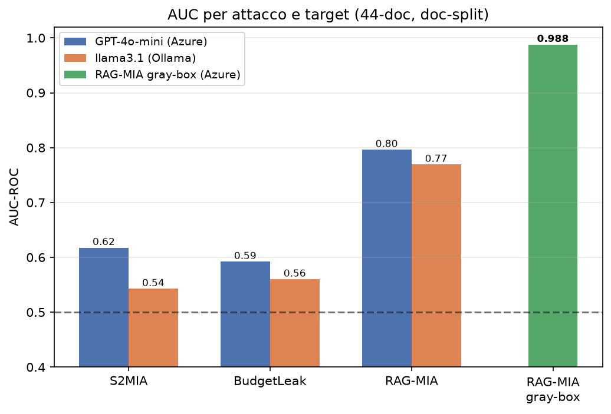
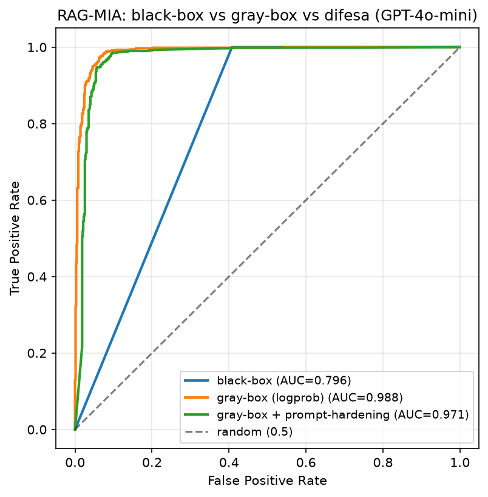
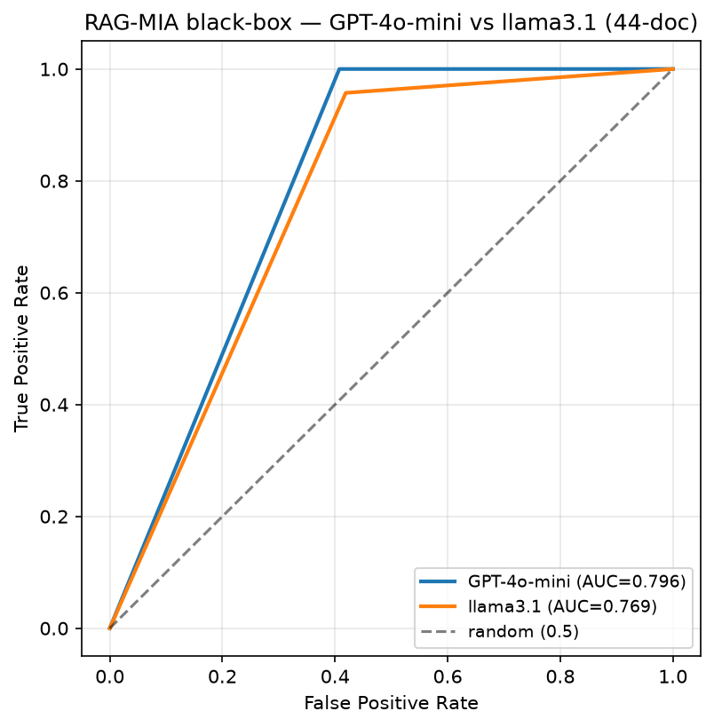
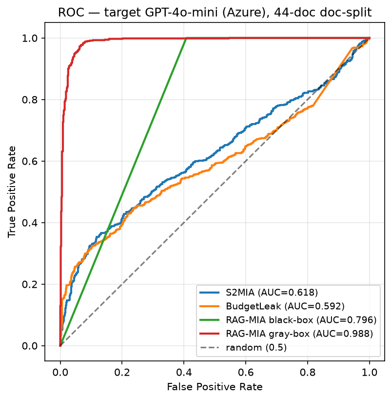
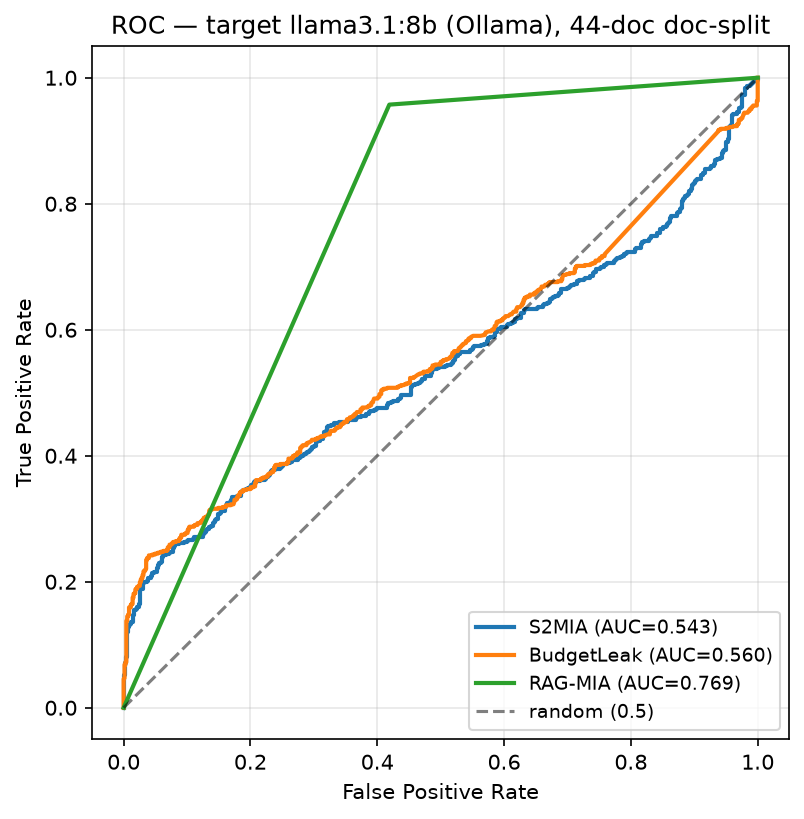
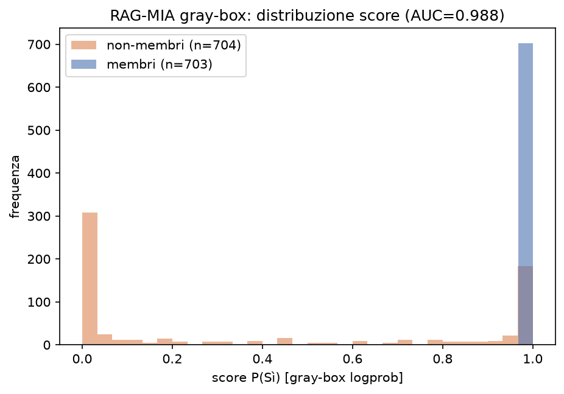

# Experimental Results

Membership Inference Attacks against a Retrieval-Augmented Generation (RAG)
system, black-box setting. All figures are **aggregate metrics only** — no
document content, identifiers, or proprietary data are exposed.

## Scenario

An enterprise RAG is built over an **internal technical wiki**. A data-governance
failure causes **client/company documents (containing PII)** to be *erroneously*
indexed alongside the legitimate wiki. We measure whether a black-box attacker,
querying only the `question → answer` interface, can detect the presence of
indexed documents — quantifying the privacy damage of the accidental inclusion.

- **Corpus**: 44 documents (33 technical wiki pages + 11 client/company reports)
  → **1407 chunks**.
- **Membership split**: document-level (`--split doc`) — whole documents are
  members (indexed) or held-out non-members. This avoids the sibling-chunk
  leakage of a naive chunk-level split (see *Methodology* below).
- **Targets**: **GPT-4o-mini** (Azure OpenAI, commercial API) and
  **llama3.1:8b** (Ollama, local).
- **Prior**: membership prior π = 0.1 for PPV.
- All source documents are pseudonymized before indexing (fail-closed PII gate);
  the real corpus never leaves the local machine.

## Attacks

| Attack | Signal | Access |
|---|---|---|
| **RAG-MIA** (Anderson 2025) | prompt injection → Yes/No verdict | black-box; gray-box via logprobs |
| **S2MIA** (Li 2025) | BLEU(answer, doc) + perplexity | black-box; gray-box via native perplexity |
| **BudgetLeak** (Li 2025) | quality-vs-generation-budget side-channel | black-box |

## Main results (AUC / TPR@1%FPR / advantage)

| Attack | GPT-4o-mini | llama3.1 |
|---|---|---|
| S2MIA | 0.618 / 0.081 / 0.235 | 0.543 / 0.132 / 0.179 |
| BudgetLeak | 0.592 / 0.155 / 0.221 | 0.560 / 0.159 / 0.202 |
| RAG-MIA (black-box) | 0.796 / 0.000 / 0.592 | 0.769 / 0.000 / 0.538 |
| S2MIA (gray-box, native perplexity) | 0.655 / 0.084 / 0.255 | — (no logprobs) |
| **RAG-MIA (gray-box, logprobs)** | **0.988 / 0.750 / 0.910** | — (no logprobs) |



## Key findings

1. **Gray-box logprobs make RAG-MIA near-perfect.** Turning the discrete Yes/No
   verdict into a continuous `P(Yes)` from token logprobs lifts RAG-MIA from
   **AUC 0.796 → 0.988** and, crucially, **TPR@1%FPR 0.000 → 0.750**. The
   discrete-score limitation (no operating point at low FPR) disappears. This is
   only possible on APIs that expose logprobs (Azure), not on the local model.

   

2. **The commercial model is more vulnerable.** GPT-4o-mini scores higher than
   llama3.1:8b on **all** attacks — being more fluent and context-grounded, it
   reproduces indexed content more faithfully, strengthening the textual signal.

   

3. **Prompt-hardening does not neutralize RAG-MIA.** Instructing the model to
   refuse presence queries only dents the attack (black-box 0.796 → 0.734;
   gray-box 0.988 → **0.971**), it does not collapse it to random. GPT-4o-mini is
   *context-grounded* — the flan-ul2 case in Anderson (2025), not the llama-3
   case where the defense works.

   | RAG-MIA (GPT-4o-mini) | baseline | prompt-hardening |
   |---|---|---|
   | black-box | 0.796 | 0.734 |
   | gray-box | 0.988 | 0.971 |

4. **Native perplexity beats the proxy.** S2MIA using the target's own logprobs
   (0.655) outperforms the GPT-2 English proxy (0.618) on the Italian corpus.

## ROC per target

| GPT-4o-mini (Azure) | llama3.1 (Ollama) |
|---|---|
|  |  |

Score separation of the strongest attack (RAG-MIA gray-box):



## Methodology note — why document-level split matters

A naive **chunk-level** split (shuffle all chunks, 50/50) places sibling chunks
of the *same* document on both sides: a non-member chunk's neighbours are indexed
as members, so the retriever surfaces them and members/non-members become nearly
indistinguishable. Measured leakage: **72–79%** of non-member chunks retrieved a
chunk from their own document. The **document-level** split removes this (0%
same-document retrieval) and is the literature-standard (Li 2025, Anderson 2025).

Metric note: for **black-box RAG-MIA**, scores are discrete `{0, 0.5, 1.0}` →
`TPR@1%FPR` and `PPV` are 0 by construction; use **AUC** and **advantage**. The
gray-box (continuous) variant restores the full low-FPR metrics.

## Reproduce

```bash
uv sync
# ingest a local corpus (kept out of the repo) with the PII gate
HF_HUB_DISABLE_XET=1 PYTHONPATH=src uv run python scripts/run_ingestion.py
# attacks (document-level split); add --llm azure_openai and/or --graybox
PYTHONPATH=src uv run python scripts/run_attack.py --split doc
PYTHONPATH=src uv run python scripts/run_eval.py --prior 0.1
```

Seed = 42 for all stochastic steps. LLM generation is not deterministic unless
temperature/seed are fixed provider-side.

## Ethics & privacy

The real corpus (business documents with PII) is **never** committed: it is
excluded via `.gitignore` and pseudonymized before indexing by a fail-closed gate
(Italian tax codes / VAT / cadastral IDs via regex, Italian NER for names and
organizations, configurable company-name list, a ≥9-digit backstop, and inline
system-credential redaction). Verified: **zero residual PII** on the real ingest.
Only code and aggregate metrics are published here.
